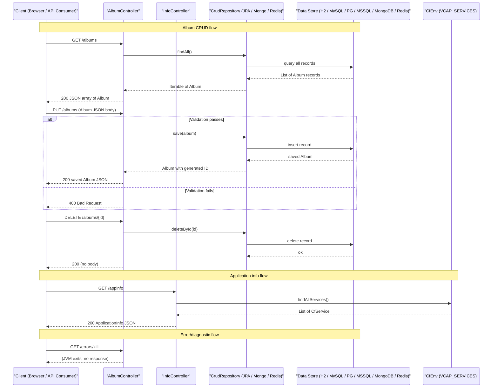

# API & Service Communication Contracts

Spring Music exposes a REST API with 10 endpoints across three controllers, served by a single Spring Boot service with no API gateway or inter-service communication — all client interactions are direct HTTP calls to the application.

## Service Catalog

| Service | Port | Category | Purpose |
|---|---|---|---|
| spring-music | 8080 (default) | Business | Monolithic Spring Boot service providing album CRUD, application info, and diagnostic error endpoints |

## API Endpoints Inventory

| Service | Method | Path | Request Type | Response Type |
|---|---|---|---|---|
| AlbumController | GET | /albums | — | `Iterable<Album>` (200) |
| AlbumController | PUT | /albums | `Album` (request body, validated) | `Album` (200); 400 if validation fails |
| AlbumController | POST | /albums | `Album` (request body, validated) | `Album` (200); 400 if validation fails |
| AlbumController | GET | /albums/{id} | `id` (path param) | `Album` (200), `null` if not found |
| AlbumController | DELETE | /albums/{id} | `id` (path param) | 200 (no body) |
| InfoController | GET | /appinfo | — | `ApplicationInfo` (200) |
| InfoController | GET | /request | — | `Map<String, String>` request metadata (200) |
| InfoController | GET | /service | — | `List<CfService>` bound CF services (200) |
| ErrorController | GET | /errors/kill | — | Terminates JVM process (no response) |
| ErrorController | GET | /errors/fill-heap | — | Allocates heap until OOM crash (no response) |
| ErrorController | GET | /errors/throw | — | Throws NullPointerException (500) |

## Management & Observability Endpoints

All Spring Boot Actuator endpoints are fully exposed (`management.endpoints.web.exposure.include: "*"`).

| Service | Endpoint | Notes |
|---|---|---|
| spring-music | /actuator/health | Shows full health details including data source status |
| spring-music | /actuator/info | Application build and git information |
| spring-music | /actuator/metrics | Micrometer metrics (JVM, HTTP server, datasource pool) |
| spring-music | /actuator/env | Full environment and property sources |
| spring-music | /actuator/beans | All Spring beans registered in the context |
| spring-music | /actuator/mappings | All HTTP request handler mappings |
| spring-music | /actuator/loggers | Runtime logger level management |
| spring-music | /actuator/* | All other standard Actuator endpoints are also active |

No custom Micrometer `@Timed` annotations or custom metric registrations were found in the source code.

## DTOs & Contracts

**Service-level domain objects used as API contracts:**

- **`Album`** — Core entity used as both request body (PUT/POST) and response type (GET). It is a mutable JPA `@Entity`; the same class serves all three persistence backends (JPA, MongoDB, Redis). Full field definitions are in `data-architecture.md`.
- **`ApplicationInfo`** — Simple response DTO returned by `GET /appinfo`. Carries active Spring profiles and bound CF service names. Not an entity; constructed on-demand in `InfoController`.
- **`Map<String, String>`** — Ad-hoc anonymous response type for `GET /request`, carrying session ID, protocol, method, scheme, and remote address. Not a named DTO class.
- **`CfService`** (from `io.pivotal.cfenv`) — Third-party model object returned verbatim by `GET /service`; represents a bound Cloud Foundry service instance.

**No OpenAPI / Swagger specification** (no Springdoc, Springfox, or openapi.yaml) is present.
**No protobuf or GraphQL schemas** were found.
**Serialization**: Jackson (Spring Boot default) handles JSON for all endpoints. Redis persistence additionally uses `Jackson2JsonRedisSerializer<Album>` configured in `RedisConfig`.

## Communication Patterns

**Synchronous (REST only):** All client-to-service communication is synchronous HTTP/REST. There are no inter-service REST calls, Feign clients, RestTemplate usage, or WebClient calls — the application is a single deployable unit with no downstream service dependencies.

**Asynchronous:** No message queues, event-driven patterns, Kafka, or RabbitMQ are used.

**Resilience patterns:** No circuit breaker (Resilience4j, Spring Retry), retry policies, timeout configuration, or bulkhead patterns are configured.

**Service discovery:** Not applicable for a single-service application. When deployed to Cloud Foundry, the platform handles routing; no Eureka, Consul, or Kubernetes DNS service registration is present in the application.

**API gateway:** No API gateway (Spring Cloud Gateway, Kong, etc.) is configured.

**Startup dependency chain:** `AlbumRepositoryPopulator` seeds initial data on `ApplicationReadyEvent`, meaning the REST API may briefly return empty results if a client queries before the event fires. For full startup configuration details, see `configuration-inventory.md`.

**Security posture:** **No authentication, authorization, or TLS is configured at the application level.** All 10 REST endpoints and all Actuator endpoints (including `/actuator/env`, `/actuator/beans`, and others that expose sensitive runtime details) are publicly accessible with no security controls. The `ErrorController` endpoints (`/errors/kill`, `/errors/fill-heap`) that can crash the process are also completely unprotected. Spring Security is not included as a dependency.

## Service Technology Matrix

| Service | Web Framework | Data Access | Discovery | Gateway | Actuator | Cache | Metrics |
|---|---|---|---|---|---|---|---|
| spring-music | Spring MVC (Servlet) | Spring Data JPA / MongoDB / Redis (profile-selected) | None | None | Full (all endpoints) | Spring Data Redis (optional profile) | Micrometer (default export) |

## Service Communication Sequence

