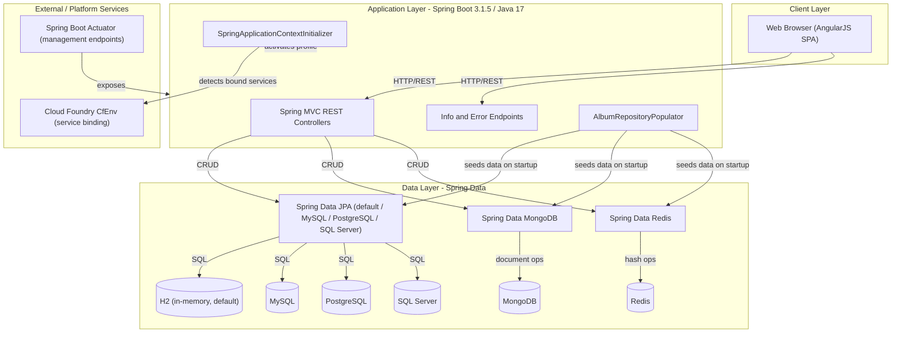
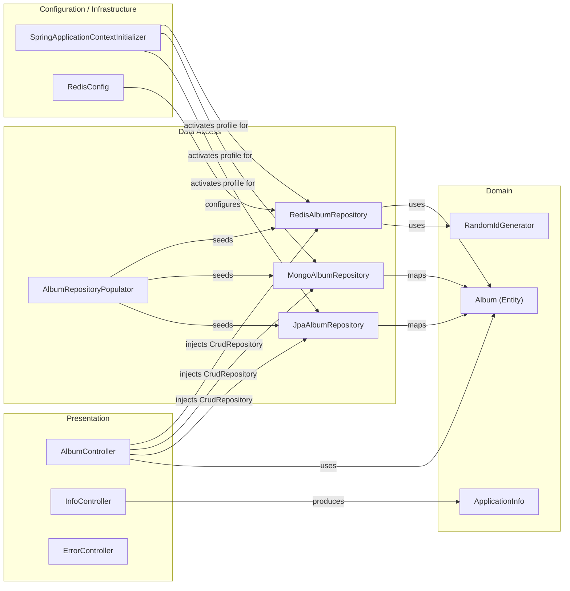

# Architecture Diagram

Spring Music is a Spring Boot 3.1.5 sample application that demonstrates the use of multiple data stores (relational databases, MongoDB, and Redis) through Spring Data, serving a single-page AngularJS front-end via REST APIs.

## Application Architecture

### Technology Stack Summary

| Layer | Technology | Version | Purpose |
|---|---|---|---|
| Presentation | AngularJS (WebJars) | 1.2.16 | Single-page application front-end |
| Presentation | Bootstrap (WebJars) | 3.1.1 | UI styling |
| Application | Spring Boot | 3.1.5 | Application framework and auto-configuration |
| Application | Spring MVC | (Boot-managed) | REST API endpoints |
| Application | Spring Boot Actuator | (Boot-managed) | Management and health endpoints |
| Application | java-cfenv-boot | 3.1.2 | Cloud Foundry service binding detection |
| Data Access | Spring Data JPA | (Boot-managed) | Relational database access (H2/MySQL/PostgreSQL/SQL Server) |
| Data Access | Spring Data MongoDB | (Boot-managed) | MongoDB document database access |
| Data Access | Spring Data Redis | (Boot-managed) | Redis key-value store access |
| Runtime | Java | 17 | JVM runtime |

### Data Storage & External Services

Spring Music supports six interchangeable data stores selected via Spring profiles: **H2** (default, in-memory), **MySQL**, **PostgreSQL**, **SQL Server** (all via Spring Data JPA), **MongoDB** (via Spring Data MongoDB), and **Redis** (via Spring Data Redis with Jackson serialization). Only one store is active at runtime, selected automatically by `SpringApplicationContextInitializer` based on bound Cloud Foundry services (detected through `java-cfenv`), or by explicitly activating a Spring profile. Spring Boot Actuator exposes health, metrics, and other management endpoints with full detail enabled.

### Key Architectural Decisions

- **Profile-based data store switching**: `SpringApplicationContextInitializer` detects Cloud Foundry service bindings at startup and activates the matching Spring profile, enabling the same codebase to run against any of six supported databases without code changes.
- **Repository pattern via Spring Data**: All data access is abstracted through a single `CrudRepository<Album, String>` interface; the concrete implementation (JPA, MongoDB, or Redis) is injected based on the active profile.
- **Static SPA with REST back-end**: The front-end is a pure AngularJS single-page application served as static resources, communicating with the back-end exclusively through REST endpoints — no server-side template rendering.

## Component Relationships

### Component Inventory

| Component | Layer | Type | Responsibility |
|---|---|---|---|
| AlbumController | Presentation | REST Controller | Exposes CRUD REST API for albums at `/albums` |
| InfoController | Presentation | REST Controller | Exposes app info (`/appinfo`), request info (`/request`), and CF service info (`/service`) |
| ErrorController | Presentation | REST Controller | Provides diagnostic error-trigger endpoints (`/errors/kill`, `/errors/fill-heap`, `/errors/throw`) |
| Album | Domain | JPA Entity | Core domain object representing a music album |
| ApplicationInfo | Domain | DTO | Holds active profiles and bound service names for info endpoint |
| RandomIdGenerator | Domain | Utility | Generates random string IDs for album entities |
| JpaAlbumRepository | Data Access | Spring Data JPA Repository | Provides relational database persistence (active when mongodb and redis profiles are absent) |
| MongoAlbumRepository | Data Access | Spring Data MongoDB Repository | Provides MongoDB document persistence (active on `mongodb` profile) |
| RedisAlbumRepository | Data Access | Spring Data Redis Repository | Provides Redis hash-based persistence (active on `redis` profile) |
| AlbumRepositoryPopulator | Data Access | ApplicationListener | Seeds initial album data from `albums.json` on first startup |
| SpringApplicationContextInitializer | Configuration | ApplicationContextInitializer | Detects CF service bindings via CfEnv and activates corresponding Spring profile |
| RedisConfig | Configuration | Configuration | Configures `RedisTemplate` with Jackson JSON serialization for Album objects |
