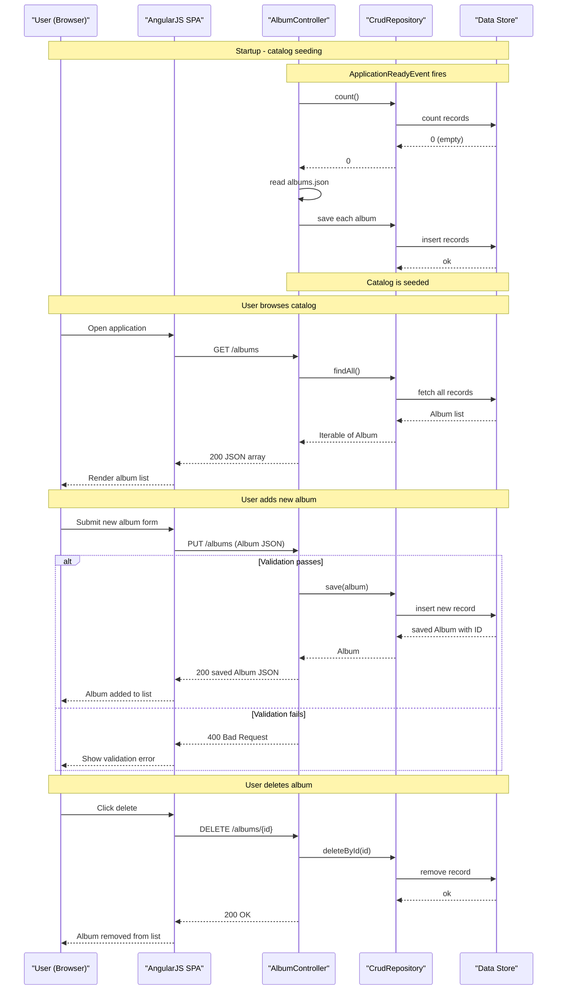

# Core Business Workflows

Spring Music is a music album catalog application that lets users browse, create, update, and delete album records across multiple interchangeable data stores, demonstrating cloud-native data store portability.

## Domain Entities

| Entity | Service / Bounded Context | Description | Key Relationships |
|---|---|---|---|
| Album | Music Catalog (spring-music) | A music album record with metadata: title, artist, release year, genre, and track count. The sole domain object in the application. | No relationships — the catalog is a flat collection of standalone album records |

## Service-to-Domain Mapping

Spring Music is a single-service (monolithic) application with one bounded context:

| Service | Domain Context | Owned Entities | External Dependencies |
|---|---|---|---|
| spring-music | Music Catalog | Album | Cloud Foundry VCAP_SERVICES (service binding detection); active data store (H2 / MySQL / PostgreSQL / SQL Server / MongoDB / Redis — one selected at startup) |

No cross-service or cross-context data exchange patterns exist; there is one service and one bounded context.

## Primary Workflows

### Workflow 1: Browse Album Catalog

A user opens the application and views the full list of albums in the catalog.

**Steps:**
1. The AngularJS SPA loads in the browser and calls `GET /albums`.
2. `AlbumController` delegates to the active `CrudRepository` implementation.
3. The repository fetches all `Album` records from the active data store.
4. The full album list is returned as a JSON array to the SPA.
5. The SPA renders the albums in list or grid view.

**Business rules involved:** None — no filtering, pagination, or access control is applied. All albums are returned.

---

### Workflow 2: Add New Album

A user submits a new album entry through the UI.

**Steps:**
1. User fills in album details in the AngularJS form and submits.
2. The SPA sends `PUT /albums` with the album JSON body.
3. `AlbumController` invokes Jakarta Bean Validation (`@Valid`) on the incoming `Album` object.
4. If validation fails, a `400 Bad Request` is returned immediately.
5. If validation passes, `AlbumController` calls `repository.save(album)`.
6. The active repository generates a new UUID for the album (`RandomIdGenerator` for JPA; internal UUID generation for MongoDB/Redis) and persists the record.
7. The saved `Album` (with generated ID) is returned as a JSON response.
8. The SPA adds the new album to the displayed list.

**Business rules involved:**
- Jakarta Bean Validation constraints on `Album` fields (e.g., `@NotBlank` on title, artist) — returning 400 on failure.
- ID is always system-generated; clients cannot supply their own ID for new records.

---

### Workflow 3: Update Existing Album

A user edits an existing album's details.

**Steps:**
1. User edits album fields in the UI form and saves.
2. The SPA sends `POST /albums` with the full `Album` JSON body (including the existing ID).
3. `AlbumController` invokes Jakarta Bean Validation (`@Valid`).
4. If validation fails, a `400 Bad Request` is returned.
5. If valid, `repository.save(album)` is called; since the ID already exists, the data store performs an update (upsert semantics for JPA, MongoDB, and Redis).
6. The updated `Album` is returned as a JSON response.
7. The SPA reflects the updated record in the list.

**Business rules involved:**
- Same validation as the Add workflow.
- The distinction between "create" (PUT) and "update" (POST) is purely at the HTTP method level; both delegate to `repository.save()`.

---

### Workflow 4: Delete Album

A user removes an album from the catalog.

**Steps:**
1. User clicks the delete button for an album in the SPA.
2. The SPA sends `DELETE /albums/{id}`.
3. `AlbumController` calls `repository.deleteById(id)` with the path-variable ID.
4. The data store removes the record; no confirmation or soft-delete is performed.
5. A `200 OK` with no body is returned.
6. The SPA removes the album from the displayed list.

**Business rules involved:** No validation on delete. If the ID does not exist, the operation silently succeeds (Spring Data default behavior for `deleteById`).

---

### Workflow 5: Application Startup — Catalog Seeding

When the application starts with an empty data store, it automatically populates the catalog with a set of well-known albums.

**Steps:**
1. Spring Boot application context finishes loading all beans.
2. `ApplicationReadyEvent` is fired.
3. `AlbumRepositoryPopulator` receives the event and obtains the active `CrudRepository` bean from the application context.
4. It calls `repository.count()` to check whether any albums already exist.
5. If the count is 0, it reads `albums.json` from the classpath using `Jackson2ResourceReader` and deserializes the list of `Album` objects.
6. Each album is passed to `repository.save()` to persist it.
7. After seeding, the catalog is ready for user interaction.

**Business rules involved:**
- Seeding only runs on the first startup (empty repository check). Subsequent restarts of the same data store skip seeding.
- For H2 (in-memory), seeding runs on every startup because the database is ephemeral.

---

### Workflow 6: Data Store Profile Selection at Startup

Before the application context is fully built, the runtime selects which data store to use.

**Steps:**
1. `SpringApplicationContextInitializer` runs during the `ApplicationContext` initialization phase (before beans are created).
2. It reads `VCAP_SERVICES` from the environment via `CfEnv` and scans bound services for known tags (`mongodb`, `postgres`, `mysql`, `redis`, `oracle`, `sqlserver`).
3. If a matching service is found, its profile name is added as an active Spring profile.
4. If more than one matching service is found, an `IllegalStateException` is thrown immediately (constraint: only one data store allowed).
5. Unused auto-configurations are excluded based on the active profile (e.g., MongoDB and Redis auto-config are excluded when a JPA profile is selected).
6. The application context continues with exactly one data store implementation wired.

**Business rules involved:**
- Exactly zero or one data store profile may be active at a time — enforced by `IllegalStateException` at startup.
- If no CF service is bound and no explicit profile is set, H2 in-memory is the default.

## Cross-Service Data Flows

Spring Music has no cross-service data flows — it is a single-service monolithic application with one REST layer and one data store active at runtime. All data access is local to the same JVM process.

The only externally sourced data is the Cloud Foundry service binding metadata read from `VCAP_SERVICES` (a platform-injected environment variable). This is not a service-to-service call; it is a platform environment read performed once at startup by `java-cfenv-boot`.

There are no API gateway aggregation patterns, no circuit breaker fallback compositions, and no cross-domain data joins. If the active data store is unavailable, the application fails to start or throws exceptions on data access — there is no fallback or degraded mode.

## Business Workflow Sequence

## Business Rules & Decision Logic

### Validation Rules

- **Album input validation** (applies to PUT and POST /albums): Jakarta Bean Validation (`@Valid`) is applied to the incoming `Album` request body. If any constraint is violated, Spring returns a `400 Bad Request` automatically before the controller method body executes.
- **ID generation**: On create (PUT), the ID field is always system-generated using `RandomIdGenerator` (UUID-based). A client-supplied ID in the body is overwritten by the repository for JPA; for Redis, `save()` only assigns an ID if `album.getId() == null`.

### Business Constraints

- **Single data store constraint**: At most one data store profile (`mysql`, `postgres`, `sqlserver`, `mongodb`, `redis`) may be active simultaneously. Violation causes an `IllegalStateException` with a descriptive message at startup.
- **Seeding guard**: The seed data workflow (`AlbumRepositoryPopulator`) only populates an empty repository. This prevents duplicate seeding on service restarts against persistent data stores.

### State Transitions

Albums do not have lifecycle states — there is no status field, soft delete, or approval workflow. An album is either present in the catalog or not.

### Transactions

No explicit `@Transactional` annotations appear in the application code. Transaction management is delegated to Spring Data's built-in behavior: save and delete operations on JPA repositories are automatically wrapped in transactions. MongoDB and Redis operations use their respective consistency models (single-document atomicity for MongoDB; no transactions for Redis).

### Error Handling

- Validation failures return `400 Bad Request` (handled by Spring MVC's default exception handling).
- `ErrorController` provides three intentional diagnostic endpoints for testing fault tolerance: `/errors/kill` (JVM exit), `/errors/fill-heap` (OOM), and `/errors/throw` (uncaught exception → 500). These are test utilities, not business error handlers.
- No business exception types, compensating transactions, dead-letter queues, or saga patterns are present.

### Audit / Logging

- `AlbumController` logs album add, update, get-by-ID, and delete operations at INFO level via SLF4J.
- No audit trail, change history, or timestamped modification tracking is implemented on the `Album` entity.

### Authorization

No business-level authorization is configured. All endpoints are publicly accessible with no role checks, ownership validation, or Spring Security integration. See `api-service-contracts.md` for the security posture summary.
