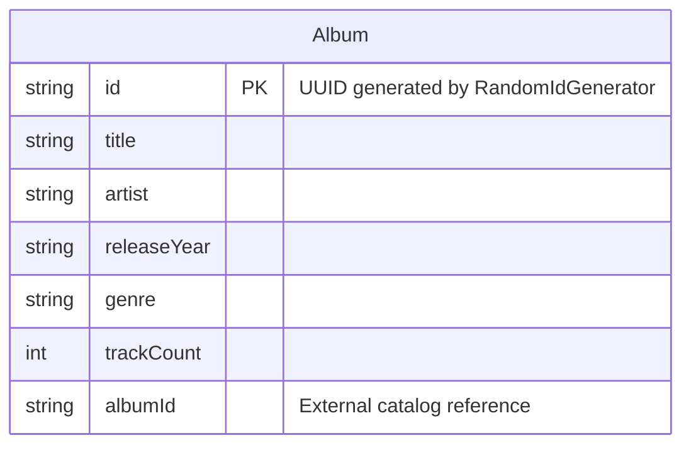

# Data Architecture & Persistence Layer

Spring Music uses a single JPA entity (`Album`) persisted across six interchangeable data stores — H2, MySQL, PostgreSQL, SQL Server, MongoDB, and Redis — selected at startup via Spring profiles, with no schema migration tooling and JSON-based seed data loading.

## Database Configuration

| Service/Module | DB Type | Profile | Driver | Connection | Migration Tool |
|---|---|---|---|---|---|
| spring-music | H2 (in-memory) | default (no profile) | `com.h2database:h2` (runtime) | In-memory; auto-configured by Spring Boot | None — Hibernate `generate-ddl: true` auto-creates schema |
| spring-music | MySQL | `mysql` | `com.mysql:mysql-connector-j` (runtime) | `jdbc:mysql://localhost/music`; default credentials | None — Hibernate DDL auto |
| spring-music | PostgreSQL | `postgres` | `org.postgresql:postgresql` (runtime) | `jdbc:postgresql://localhost/music`; user `postgres` | None — Hibernate DDL auto |
| spring-music | SQL Server | `sqlserver` | `com.microsoft.sqlserver:mssql-jdbc` (runtime) | Auto-configured via CF service binding (CfEnv) | None — Hibernate DDL auto |
| spring-music | MongoDB | `mongodb` | Spring Data MongoDB (Netty transport) | Auto-configured via CF service binding or `spring.data.mongodb.*` | None — schema-less document store |
| spring-music | Redis | `redis` | Spring Data Redis (Jedis) + `commons-pool2` | Auto-configured via CF service binding or `spring.redis.*` | None — schema-less key-value store |

**Schema management:** For JPA profiles (H2/MySQL/PostgreSQL/SQL Server), Hibernate auto-generates DDL (`spring.jpa.generate-ddl: true`). No Flyway or Liquibase is present. For full property details, see `configuration-inventory.md`.

**Seed data:** `AlbumRepositoryPopulator` listens for `ApplicationReadyEvent` and loads albums from `src/main/resources/albums.json` using Jackson `Jackson2ResourceReader` — but only if the repository is empty. This applies to all three persistence backends (JPA, MongoDB, Redis).

## Data Ownership per Service

| Service | Tables / Collections / Keys Owned | ORM Framework | Caching | Notes |
|---|---|---|---|---|
| spring-music | `album` table (JPA profiles) / `albums` collection (MongoDB) / `albums` hash (Redis) | Spring Data JPA (Hibernate) / Spring Data MongoDB / Spring Data Redis | No Spring Cache layer; Redis itself is the primary store (not a cache) | Single entity; schema created automatically by Hibernate for SQL profiles |

## Entity Model

**Notes:**
- `Album` is the only entity in the application.
- For JPA backends, `id` is a 40-character `VARCHAR` column generated by `RandomIdGenerator` (UUID-based custom `IdentifierGenerator`).
- For MongoDB, `Album` is stored as a BSON document in the `albums` collection; `id` maps to `_id`.
- For Redis, `Album` objects are stored as hash values serialized to JSON using `Jackson2JsonRedisSerializer`, keyed under the hash name `albums` with `id` as the field key.
- The `albumId` field is a secondary external identifier (not the primary key) and can be null.
- `trackCount` defaults to 0 (Java `int` primitive).
- No `@OneToMany`, `@ManyToOne`, or any relational associations exist — the model is a single flat entity.

## Key Repository Methods

| Service | Repository | Interface | Notable Methods | Purpose |
|---|---|---|---|---|
| spring-music | `JpaAlbumRepository` | `JpaRepository<Album, String>` | All inherited CRUD + JPA query methods | Active on profiles where `mongodb` and `redis` are both absent |
| spring-music | `MongoAlbumRepository` | `MongoRepository<Album, String>` | All inherited CRUD + MongoDB query methods | Active on `mongodb` profile only |
| spring-music | `RedisAlbumRepository` | `CrudRepository<Album, String>` (custom impl) | `save`, `saveAll`, `findById`, `findAll`, `findAllById`, `existsById`, `count`, `deleteById`, `delete`, `deleteAll`, `deleteAllById` | Active on `redis` profile; uses `HashOperations` on a single `albums` hash key |

No custom `@Query`-annotated methods, derived query methods, named queries, or stored procedure calls are defined. No `@Transactional` annotations appear in controller or repository layers — transaction management is handled entirely by Spring Data's defaults (auto-transaction on save/delete for JPA).

## Caching Strategy

No Spring Cache abstraction (`@Cacheable`, `@CacheEvict`, `@CachePut`, `@EnableCaching`) is used. There is no second-level Hibernate cache, no EhCache, no Caffeine, and no session caching.

**Redis as primary store (not a cache):** When the `redis` profile is active, Redis is the exclusive persistence backend for `Album` objects — it is not a cache in front of another database. Data is stored in a single Redis hash named `albums`, with each album's UUID as the field key and a Jackson-serialized JSON blob as the value. There is no TTL, expiration policy, or eviction configuration — data persists as long as the Redis instance is running.

**Rationale:** The application is a demonstration sample, and the Redis integration is intentionally simple — its purpose is to show that Spring Music can use Redis as a data store, not to optimize read latency.

## Data Ownership Boundaries

**Single-service, profile-selected data store:** Spring Music is a monolithic single-service application. There is no cross-service data sharing or access. The `Album` entity is owned exclusively by the spring-music service, and only one data store is active at runtime.

**Shared vs isolated:** Because only a single service exists, the concept of shared vs isolated data stores does not apply. The profile-based selection means each deployment of the application is bound to exactly one backend.

**Read/write patterns:** All access is read-write through the `CrudRepository` interface injected into `AlbumController`. No CQRS, read replicas, or event sourcing patterns are used.

**Cross-service data access:** Not applicable — there is only one service and no inter-service calls.

### Data Classification & Sensitivity

| Entity | Sensitive Fields | Classification | Controls in Place |
|---|---|---|---|
| Album | None — contains only music metadata (artist name, album title, release year, genre, track count) | None (public media catalog data) | N/A |

No PII, PHI, or PCI data is stored in the entity model. Album data (artist names, titles, genres, release years) is publicly available music catalog information with no privacy or compliance sensitivity.
