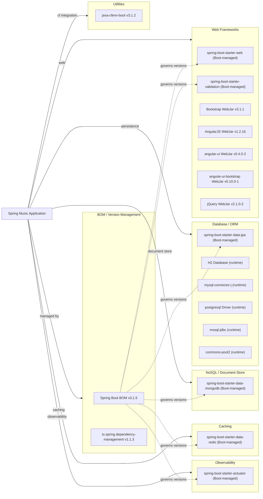

# Dependency Map

Spring Music declares 17 runtime/compile-scope external dependencies (managed through Spring Boot 3.1.5 BOM) plus 2 test-scope dependencies, covering web, data persistence, caching, observability, Cloud Foundry integration, and front-end UI libraries.

## Dependencies

### Dependency Summary

| Category | Count | Key Libraries | Notes |
|---|---|---|---|
| Web Frameworks | 7 | spring-boot-starter-web, Bootstrap 3.1.1, AngularJS 1.2.16, jQuery 2.1.0-2 | AngularJS and jQuery versions are severely outdated (EOL) |
| Database / ORM | 5 | spring-boot-starter-data-jpa, H2, MySQL Connector/J, PostgreSQL, mssql-jdbc | All JDBC drivers are runtime-scoped; only one is active per deployment |
| NoSQL / Document Store | 1 | spring-boot-starter-data-mongodb | Profile-activated; not used in default (H2) mode |
| Caching | 1 | spring-boot-starter-data-redis | Profile-activated; not used in default (H2) mode |
| Observability | 1 | spring-boot-starter-actuator | All management endpoints exposed with full health details |
| Utilities | 1 | java-cfenv-boot 3.1.2 | Reads Cloud Foundry VCAP_SERVICES for service-binding detection |

### Version & Compatibility Risks

Spring Boot 3.1.5 is a relatively recent release but is no longer receiving OSS maintenance (3.1.x reached end of support in November 2023 — the current active line is 3.3.x/3.4.x). The front-end WebJars present the most significant risk: **AngularJS 1.2.16** reached end-of-life in December 2021, **jQuery 2.1.0-2** is extremely old (jQuery 2.x itself is EOL), and **Bootstrap 3.1.1** predates Bootstrap 5 by nearly a decade. These UI libraries are no longer receiving security patches. The JDBC drivers (MySQL, PostgreSQL, mssql-jdbc) are declared as runtime-only without pinned versions, so they are resolved by the Spring Boot BOM — this is appropriate, but the BOM version should be kept current to receive driver updates.

### Notable Observations

- **Six interchangeable data stores via one application binary**: The application bundles drivers/starters for H2, MySQL, PostgreSQL, SQL Server, MongoDB, and Redis simultaneously and activates only one at runtime through Spring profiles. This makes deployments flexible but inflates the artifact size and the attack surface.
- **AngularJS 1.2.16 is critically outdated**: AngularJS 1.x has been end-of-life since December 2021; version 1.2.x was released in 2014. Migrating to a modern front-end framework (Angular, React, or Vue) is a significant modernization item.
- **All management endpoints are fully exposed**: `management.endpoints.web.exposure.include: "*"` exposes every Actuator endpoint without authentication. In a production cloud deployment this is a security risk.
- **No explicit logging dependency declared**: Logging is handled entirely through Spring Boot's transitively included Logback. There are no direct SLF4J or Logback entries in build.gradle, which means logging configuration is fully delegated to Boot's defaults.

## Test Dependencies

| Framework | Version | Notes |
|---|---|---|
| JUnit | 4.x (Boot-managed) | Included via `junit:junit` — JUnit 4 rather than JUnit 5 |
| Spring Boot Test | 3.1.5 (Boot-managed) | `spring-boot-starter-test` provides Mockito, AssertJ, and Spring test support |

Total test-scope dependencies: 2

The project uses JUnit 4 (`junit:junit`) instead of JUnit 5 (JUnit Jupiter), which is the default in Spring Boot 3.x. `spring-boot-starter-test` already brings in JUnit 5 transitively, so the explicit JUnit 4 dependency is potentially redundant and may cause version conflicts. Upgrading the single `ApplicationTests` test class to JUnit 5 annotations would align with current Spring Boot 3.x conventions.
