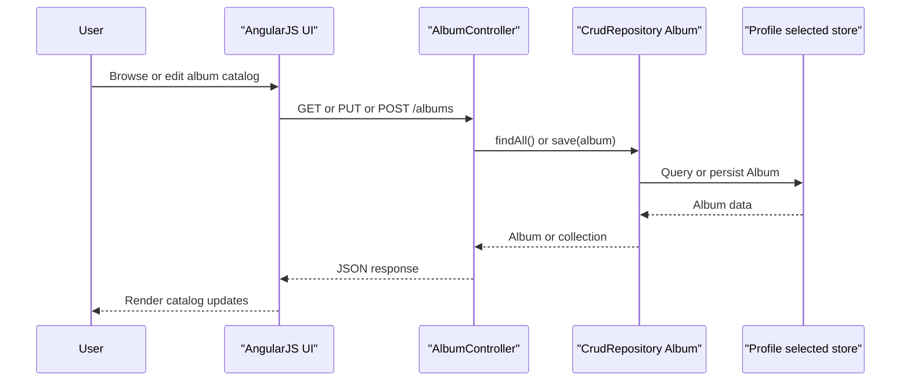

# API & Service Communication Contracts

Spring Music exposes a small REST API for album CRUD plus a few diagnostic endpoints, all served from a single Spring Boot process. Communication is entirely synchronous HTTP with JSON payloads and no downstream service-to-service API calls.

## Service Catalog

| Service | Port | Category | Purpose |
| --- | --- | --- | --- |
| `spring-music` | 8080 default | API Layer | Serves the AngularJS UI, album CRUD API, diagnostic endpoints, and actuator endpoints |

## API Endpoints Inventory

| Service | Method | Path | Request Type | Response Type |
| --- | --- | --- | --- | --- |
| `spring-music` | GET | `/albums` | None | `200 OK` with `Iterable<Album>` |
| `spring-music` | PUT | `/albums` | JSON request body mapped to mutable `Album` | `200 OK` with saved `Album` |
| `spring-music` | POST | `/albums` | JSON request body mapped to mutable `Album` | `200 OK` with saved `Album` |
| `spring-music` | GET | `/albums/{id}` | Path parameter `id` | `200 OK` with `Album` or empty body when not found |
| `spring-music` | DELETE | `/albums/{id}` | Path parameter `id` | `200 OK` with empty body |
| `spring-music` | GET | `/request` | `HttpServletRequest` context only | `200 OK` with `Map<String,String>` |
| `spring-music` | GET | `/appinfo` | None | `200 OK` with `ApplicationInfo` |
| `spring-music` | GET | `/service` | None | `200 OK` with `List<CfService>` |
| `spring-music` | GET | `/errors/kill` | None | Process exit after request |
| `spring-music` | GET | `/errors/fill-heap` | None | Unbounded memory allocation until failure |
| `spring-music` | GET | `/errors/throw` | None | Throws `NullPointerException`, resulting in server error |

API versioning is not implemented; routes are unversioned.

## Management & Observability Endpoints

| Service | Endpoint | Custom Metrics (if any) |
| --- | --- | --- |
| `spring-music` | `/actuator/*` | No custom metrics detected |
| `spring-music` | `/actuator/health` with details enabled | No custom metrics detected |

## DTOs & Contracts

The API reuses `Album` as both the request and response contract for album create and update operations, so the persistence model is exposed directly over HTTP rather than being wrapped in separate request or response DTOs. `Album` is a mutable POJO with getters and setters, while `ApplicationInfo` is a lightweight mutable response DTO carrying active profiles and bound service names. The `/request` endpoint returns a generic string map derived from the current servlet request, and `/service` exposes Cloud Foundry `CfService` objects directly.

No OpenAPI or Swagger specification, GraphQL schema, or protobuf contract was found. JSON serialization is handled by Spring Boot's default Jackson integration, and the Redis profile uses Jackson JSON serialization for repository storage as well.

## Communication Patterns

All request handling is synchronous. The AngularJS front end calls same-origin Spring MVC endpoints over HTTP and receives JSON responses. Inside the application, controllers delegate directly to a `CrudRepository<Album, String>` abstraction, which resolves to JPA, MongoDB, or Redis implementations depending on the active profile.

No asynchronous messaging, retry policy, timeout policy, circuit breaker, service discovery for inter-service API calls, or API gateway layer is implemented. Startup service discovery is limited to Cloud Foundry binding inspection in `SpringApplicationContextInitializer`, which selects a profile before the application becomes available. Security posture is minimal: no application-level authentication, authorization, or TLS enforcement is configured in code, so endpoints are publicly accessible unless protected externally by the platform or deployment environment. An optional `http2` profile enables HTTP/2 support.

## Service Technology Matrix

| Service | Web | Data Access | Discovery | Gateway | Actuator | Cache | Metrics |
| --- | --- | --- | --- | --- | --- | --- | --- |
| `spring-music` | Spring MVC + static AngularJS assets | Spring Data JPA, Spring Data MongoDB, custom Redis repository | Cloud Foundry service binding detection at startup | None | Yes | Redis profile only | Actuator defaults only |

## Service Communication Sequence

