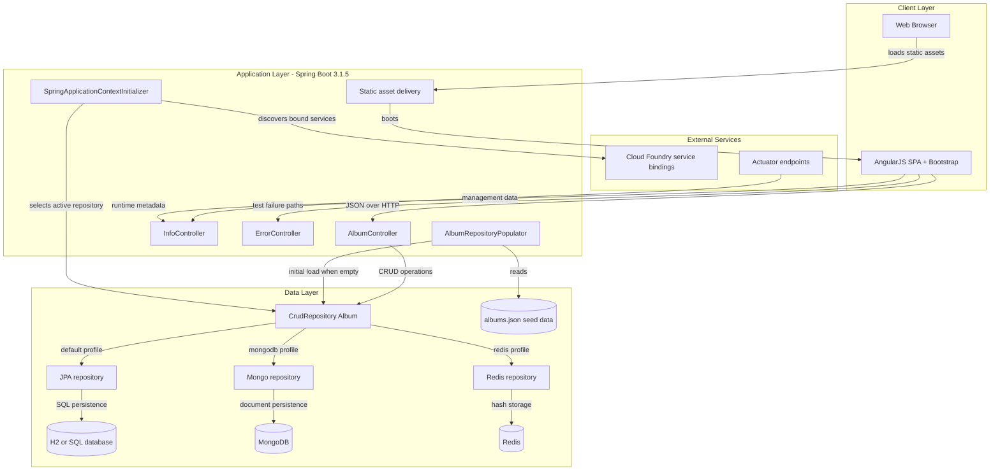
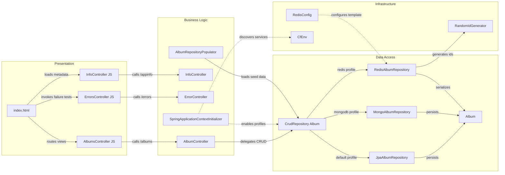

# Architecture Diagram

Spring Music is a single deployable Spring Boot application that serves an AngularJS user interface and a small JSON REST API for album management. It selects one persistence implementation at startup based on active Spring profiles or detected Cloud Foundry service bindings.

## Application Architecture

### Technology Stack Summary

| Layer | Technology | Version | Purpose |
| --- | --- | --- | --- |
| Presentation | AngularJS, Bootstrap, jQuery via WebJars | 1.2.16, 3.1.1, 2.1.0-2 | Browser UI for browsing and editing albums |
| Application | Spring Boot | 3.1.5 | Hosts REST controllers, auto-configuration, and actuator support |
| Persistence | Spring Data JPA, Spring Data MongoDB, Spring Data Redis | Managed by Spring Boot 3.1.5 | Profile-driven selection of relational, document, or key-value persistence |
| Platform Integration | Java CFEnv | 3.1.2 | Detects Cloud Foundry bound services and activates the matching profile |
| Runtime | Java | 17 | Compiles and runs the application jar |

### Data Storage & External Services

The application stores a single `Album` domain model, but it can map that model to different backing stores depending on environment: an in-memory relational database by default, SQL databases for the `mysql` and `postgres` profiles, MongoDB for the `mongodb` profile, and Redis hashes for the `redis` profile. At runtime it also consults Cloud Foundry service bindings to discover which profile to activate, while Actuator exposes management endpoints for health and diagnostics.

### Key Architectural Decisions

- Uses Spring profiles plus a custom application context initializer to switch between persistence technologies without changing controller code.
- Keeps the UI and API in the same deployable unit by serving static AngularJS assets from the Spring Boot application.
- Seeds the repository from `albums.json` on startup when the selected store is empty, ensuring demo data is available in each environment.

## Component Relationships

### Component Inventory

| Component | Layer | Type | Responsibility |
| --- | --- | --- | --- |
| `index.html` and AngularJS modules | Presentation | SPA shell | Loads templates and calls backend JSON endpoints |
| `AlbumController` | Presentation | REST controller | Handles album list, create, update, fetch, and delete requests |
| `InfoController` | Presentation | REST controller | Exposes active profiles, bound services, and request metadata |
| `ErrorController` | Presentation | REST controller | Exposes controlled failure endpoints for operational testing |
| `SpringApplicationContextInitializer` | Business Logic | Application initializer | Detects bound services, validates profiles, and excludes unused auto-configuration |
| `AlbumRepositoryPopulator` | Business Logic | Startup listener | Loads demo album data after startup when the repository is empty |
| `JpaAlbumRepository` | Data Access | Spring Data repository | Default relational persistence implementation |
| `MongoAlbumRepository` | Data Access | Spring Data repository | MongoDB persistence implementation for the `mongodb` profile |
| `RedisAlbumRepository` | Data Access | Custom repository | Redis hash-based persistence implementation for the `redis` profile |
| `RedisConfig` | Infrastructure | Configuration class | Creates the Redis template and serializers used by the Redis repository |
| `Album` | Data Access | Entity / document model | Shared album model reused across all persistence implementations |
| `RandomIdGenerator` | Infrastructure | Identifier generator | Produces UUID-based string identifiers |
