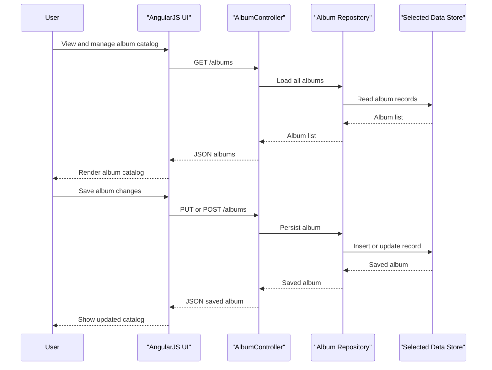

# Core Business Workflows

Spring Music lets users browse and maintain a shared catalog of music albums while demonstrating how the same workflow can run on top of different persistence technologies. The application also exposes a few operational workflows for environment introspection and failure simulation.

## Domain Entities

| Entity | Service / Bounded Context | Description | Key Relationships |
| --- | --- | --- | --- |
| `Album` | `spring-music` / Album Catalog | Represents one music album that users can create, update, view, and delete | No persisted relationships to other entities |
| `ApplicationInfo` | `spring-music` / Runtime Diagnostics | Summarizes active profiles and bound service names for the running application | Derived from runtime environment rather than persisted data |

## Service-to-Domain Mapping

| Service | Domain Context | Owned Entities | External Dependencies |
| --- | --- | --- | --- |
| `spring-music` | Album catalog management and diagnostics | `Album`, `ApplicationInfo` response model | Selected datastore, Cloud Foundry service bindings, actuator endpoints |

## Primary Workflows

### Workflow 1: Browse and maintain the album catalog

1. A browser loads the AngularJS single-page application and requests the current album list from `GET /albums`.
2. `AlbumController` delegates directly to the active `CrudRepository<Album, String>` implementation.
3. The selected repository reads album data from the current backing store and returns it as JSON.
4. When a user adds or edits an album, the browser submits the album document to `PUT /albums` or `POST /albums`.
5. The repository persists the record and returns the saved album, after generating an identifier if the store path requires one.
6. When a user deletes an album, the browser calls `DELETE /albums/{id}` and the repository removes it from the backing store.

Business rules involved: album updates always flow through the shared repository abstraction; an album id is generated automatically when one is missing; and the same UI workflow works regardless of whether the active store is relational, MongoDB, or Redis.

### Workflow 2: Select the storage profile at startup

1. The application starts with `SpringApplicationContextInitializer` registered before the Spring context refresh.
2. The initializer reads active profiles and Cloud Foundry bound service tags.
3. It fails startup if more than one persistence-oriented profile is active at the same time.
4. It activates the detected storage profile when an eligible bound service is present.
5. It injects exclusions for incompatible auto-configuration classes so that only the chosen persistence path is enabled.

Business rules involved: only one persistence technology can be selected for a running instance, and the environment is the source of truth when Cloud Foundry services are bound.

### Workflow 3: Seed demo data after the application becomes ready

1. After startup completes, `AlbumRepositoryPopulator` listens for `ApplicationReadyEvent`.
2. It checks whether the active repository already contains any albums.
3. If the repository is empty, it loads the bundled `albums.json` file and saves each album into the selected store.
4. If the repository already has data, no bootstrap write occurs.

Business rules involved: seed data is inserted only once per empty store, preserving user-managed content on later starts.

### Workflow 4: Inspect or test runtime behavior

Operators or testers can call `/appinfo` and `/service` to see active profiles and bound services, or invoke `/errors/*` endpoints to deliberately terminate the process, exhaust memory, or throw an exception when validating platform behavior.

## Cross-Service Data Flows

No multi-service business flow or gateway aggregation pattern exists in this repository. All album catalog actions execute inside the single `spring-music` service. The only external data composition is startup inspection of Cloud Foundry service bindings, which influences profile selection but does not create a user-visible aggregate response.

## Business Workflow Sequence

## Business Rules & Decision Logic

- **Profile exclusivity**: only one of the persistence-oriented profiles may be active at a time; otherwise startup fails.
- **Environment-driven store selection**: Cloud Foundry service tags can activate `mysql`, `postgres`, `mongodb`, `redis`, `oracle`, or `sqlserver` behavior without code changes.
- **Bootstrap rule**: album seed data is loaded only when the selected repository is empty.
- **Identifier generation**: album identifiers are generated automatically by Hibernate's custom UUID generator or by the Redis repository when a submitted album lacks an id.
- **Validation and integrity**: the controller methods use `@Valid`, but no server-side bean validation constraints were found on `Album`; the browser enforces a four-digit year pattern during modal editing.
- **Transactions and error handling**: repository operations rely on the default behavior of the selected Spring Data implementation; the dedicated `/errors/*` routes intentionally produce failure conditions for operational testing rather than normal business recovery.
- **Authorization**: no business-level authorization rules or ownership checks were detected.
