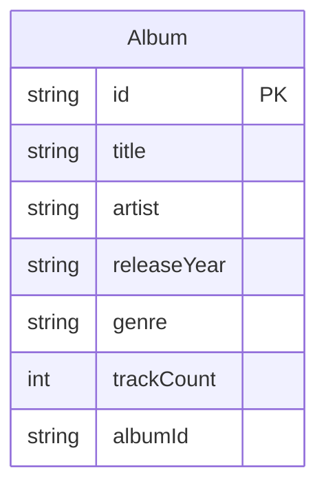

# Data Architecture & Persistence Layer

Spring Music has a deliberately simple domain model centered on a single `Album` record, but it supports multiple persistence backends chosen by Spring profile. The data layer mixes Spring Data repositories with a custom Redis repository while seeding demo content from a bundled JSON file.

## Database Configuration

| Service/Module | DB Type | Profile | Driver | Connection | Migration Tool |
| --- | --- | --- | --- | --- | --- |
| `spring-music` | In-memory relational database | default | H2 runtime driver | Spring Boot auto-configured datasource | None detected |
| `spring-music` | MySQL | `mysql` | `com.mysql.jdbc.Driver` | `jdbc:mysql://localhost/music` | None detected |
| `spring-music` | PostgreSQL | `postgres` | `org.postgresql.Driver` | `jdbc:postgresql://localhost/music` | None detected |
| `spring-music` | MongoDB | `mongodb` | Spring Data MongoDB starter | Service binding or Spring Boot defaults | None detected |
| `spring-music` | Redis | `redis` | Spring Data Redis starter | Service binding or Spring Boot defaults | None detected |

Schema management is handled by Spring Boot and Hibernate with DDL generation enabled for the relational path, while seed data comes from the bundled `albums.json` file loaded after startup when the repository is empty.

## Data Ownership per Service

| Service | Tables Owned | ORM Framework | Caching | Notes |
| --- | --- | --- | --- | --- |
| `spring-music` | `Album` table, collection, or Redis hash depending on profile | Spring Data JPA by default, Spring Data MongoDB for `mongodb`, custom Redis repository for `redis` | Redis acts as the primary store in the `redis` profile rather than as a secondary cache | Single-service application with one shared album catalog model |

## Entity Model

The entity model contains one persisted domain type and no explicit relationships to other persisted entities.

## Key Repository Methods

| Service | Repository | Notable Methods | Purpose |
| --- | --- | --- | --- |
| `spring-music` | `JpaAlbumRepository` | Inherited `JpaRepository` CRUD methods | Default relational persistence for `Album` |
| `spring-music` | `MongoAlbumRepository` | Inherited `MongoRepository` CRUD methods | MongoDB persistence for `Album` |
| `spring-music` | `RedisAlbumRepository` | `save`, `findById`, `findAll`, `findAllById`, `deleteById`, `deleteAll` | Stores albums in the Redis hash named `albums` |
| `spring-music` | `AlbumRepositoryPopulator` | Startup `populate` logic | Loads `albums.json` data when the active repository is empty |

No custom query derivation, JPQL, native SQL, or stored procedure calls were found.

## Caching Strategy

| Layer | Provider | Pattern | Scope | Notes |
| --- | --- | --- | --- | --- |
| Primary persistence in `redis` profile | Redis via `RedisTemplate<String, Album>` | Key-value / hash storage | Album repository | Redis is used as the system of record for albums when the `redis` profile is active |
| Other profiles | None detected | None | N/A | The application does not use Spring cache annotations or a second-level cache |

The Redis configuration applies Jackson JSON serialization to album values and string serialization to keys and hash keys.

## Data Ownership Boundaries

This is a single-service application, so all album data is owned inside the `spring-music` process. The only boundary variation is storage technology: relational persistence for the default, `mysql`, `postgres`, `oracle`, and `sqlserver` paths; document persistence for `mongodb`; and hash-based persistence for `redis`.

There is no cross-service database access, no CQRS split, and no read model maintained outside the selected repository implementation. Controllers access data only through the `CrudRepository<Album, String>` abstraction, allowing the active profile to swap the underlying store without changing API logic.

### Data Classification & Sensitivity

| Entity | Sensitive Fields | Classification (PII/PHI/PCI/None) | Controls in Place |
| --- | --- | --- | --- |
| `Album` | None detected | None | No special controls required for the stored fields |

No PII, PHI, or PCI data detected in the entity model.
