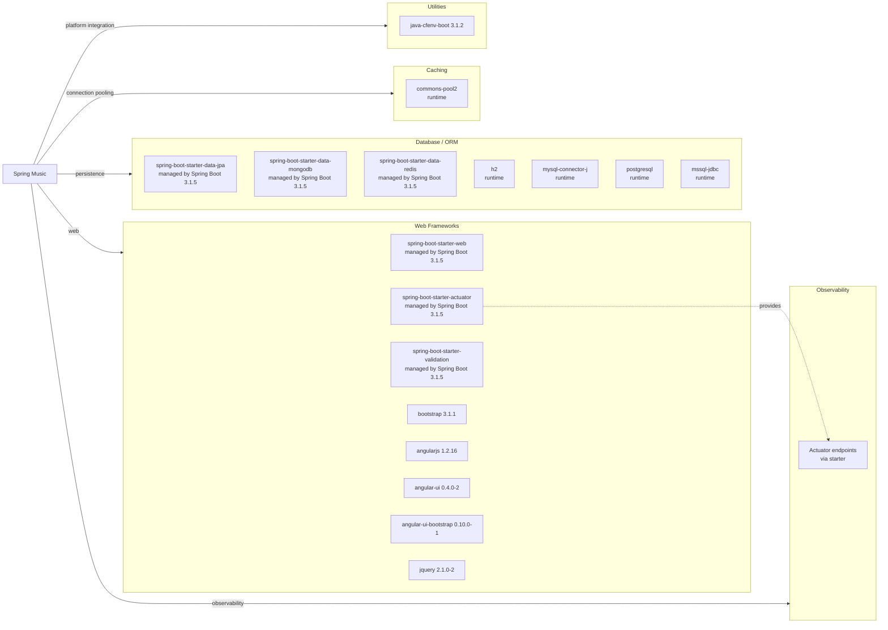

# Dependency Map

Spring Music declares a compact dependency set centered on Spring Boot starters, Cloud Foundry integration, and a legacy browser UI stack. The project has 14 direct non-test dependencies plus 2 direct test dependencies declared in `build.gradle`.

## Dependencies

### Dependency Summary

| Category | Count | Key Libraries | Notes |
| --- | --- | --- | --- |
| Web Frameworks | 8 | Spring Boot Web, Actuator, Validation, AngularJS, Bootstrap | Combines a modern Spring Boot backend with an older browser UI stack |
| Database / ORM | 7 | Spring Data JPA, MongoDB, Redis, H2, MySQL, PostgreSQL, SQL Server drivers | Enables profile-selected persistence across multiple store types |
| Caching | 1 | commons-pool2 | Runtime pooling support used by data clients |
| Observability | 1 | spring-boot-starter-actuator | Exposes management endpoints |
| Utilities | 1 | java-cfenv-boot 3.1.2 | Detects Cloud Foundry service bindings |

### Version & Compatibility Risks

The backend stack is reasonably current at Spring Boot 3.1.5 and Java 17, but the browser dependencies are notably old: AngularJS 1.2.16, Bootstrap 3.1.1, and jQuery 2.1.0-2 are legacy libraries with modernization and security considerations. The MySQL profile still references the legacy `com.mysql.jdbc.Driver` class name in configuration, which is a migration concern for newer connector generations.

### Notable Observations

- All Spring starter versions are inherited from the Spring Boot 3.1.5 dependency management BOM rather than pinned individually.
- The application keeps three persistence models in one deployable by declaring JPA, MongoDB, and Redis starters together.
- SQL connectivity is runtime-only, allowing one artifact to target H2, MySQL, PostgreSQL, or SQL Server depending on environment.
- No dedicated logging or security libraries are added beyond the defaults supplied transitively by Spring Boot starters.

## Test Dependencies

| Framework | Version | Notes |
| --- | --- | --- |
| `junit:junit` | Managed by Spring Boot 3.1.5 | Supports the existing JUnit 4 `ApplicationTests` class |
| `spring-boot-starter-test` | Managed by Spring Boot 3.1.5 | Provides Spring test support for context loading |

Total test-scope dependencies: 2

The test stack is minimal and centered on application startup verification. No separate integration-test framework, contract-testing library, or containerized test infrastructure is declared.
